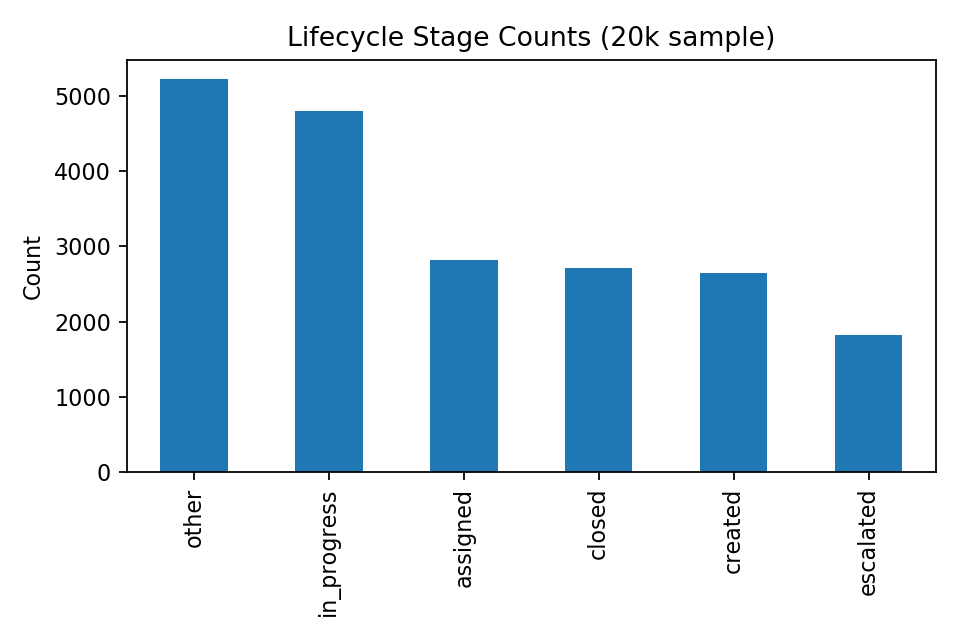
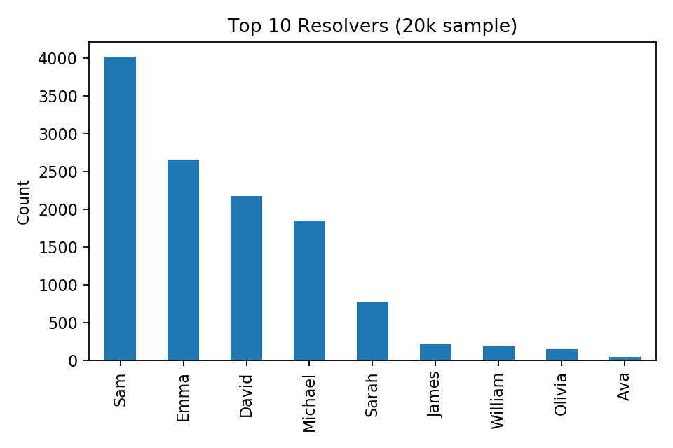

# Bug_Tracker_Analysis
BugTracker_ICT_Analytics

*ICT Bug Tracking & Support Case Study (NOV 2023–JAN 2024)*  
Analysis of ~50,000+ support tickets to identify bottlenecks, workload imbalances, and SLA compliance issues. The project simulates a real ICT Support/Business Analyst environment where tickets are logged, categorized, and resolved across different channels.  

---

## 📌 Project Overview
- Focused on *ticket lifecycle management* and *support performance analytics*.  
- Applied *SQL queries* and *Python analysis* to extract KPIs from ticket logs.  
- Designed visuals and mock dashboards to replicate BA/ICT deliverables.  
- Produced insights for *process improvement, SLA tracking, and resource allocation*.  

---

## 📊 Key Insights
- *Ticket Volumes:* Peaks during product release cycles; consistent weekly traffic.  
- *Priorities:* ~25% marked as high/critical, requiring better triaging.  
- *Resolution Time:* Average ~36 hrs; bottlenecks at “in-progress” stage.  
- *Top Resolvers:* 80% of workload handled by top 10 agents → imbalance in team load.  
- *Channels:* Email dominant → automation opportunities identified.  

---

## 📈 Visuals & Dashboards
Sample visuals generated from analysis:  

*Ticket Priority Distribution*  
  

*Ticket Lifecycle*  
  

*Top 10 Resolvers*  
  

---

## 🛠 Tools & Skills
- *SQL* – Extracting and aggregating ticket KPIs  
- *Python (Pandas, Matplotlib)* – Data cleaning & visual analytics  
- *Excel* – Pivot tables & quick reporting  
- *Power BI (mockups)* – Dashboard design for business stakeholders  

---

## 📂 Repository Structure
- */data* – ticket logs (CSV, anonymised)
- */sql* – SQL query outputs / aggregates
- */notebook* – Python analysis notebook(s)
- */images* – KPI charts & dashboard screenshots
- */docs* – report / executive summary
- *README.md* – project overview

---

- ## 📄 Business Value
- Improved *support team productivity* by highlighting ticket backlog patterns.  
- Insights helped simulate *automation recommendations* (chatbots, ticket routing).  
- Provided a *scalable framework* for monitoring SLA compliance.
